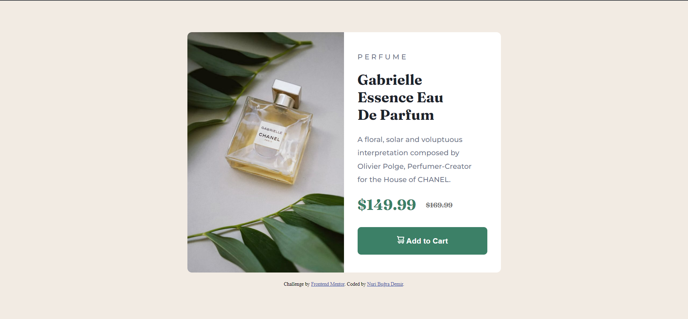

# Frontend Mentor - Product preview card component solution

This is a solution to the [Product preview card component challenge on Frontend Mentor](https://www.frontendmentor.io/challenges/product-preview-card-component-GO7UmttRfa). Frontend Mentor challenges help you improve your coding skills by building realistic projects. 

## Overview

### The challenge

Users should be able to:

- View the optimal layout depending on their device's screen size
- See hover and focus states for interactive elements

### Screenshot

### Links

- Solution URL: [Click to reach solution](https://www.frontendmentor.io/solutions/product-preview-card-component-iaKmoMLLZe)
- Live Site URL: [Click to reach live site](https://idyllic-zuccutto-ba05ca.netlify.app/)

## Author

- Frontend Mentor - [@nuribugra](https://www.frontendmentor.io/profile/nuribugra)
- Twitter - [@nuribugrademir](https://www.twitter.com/nuribugrademir)
